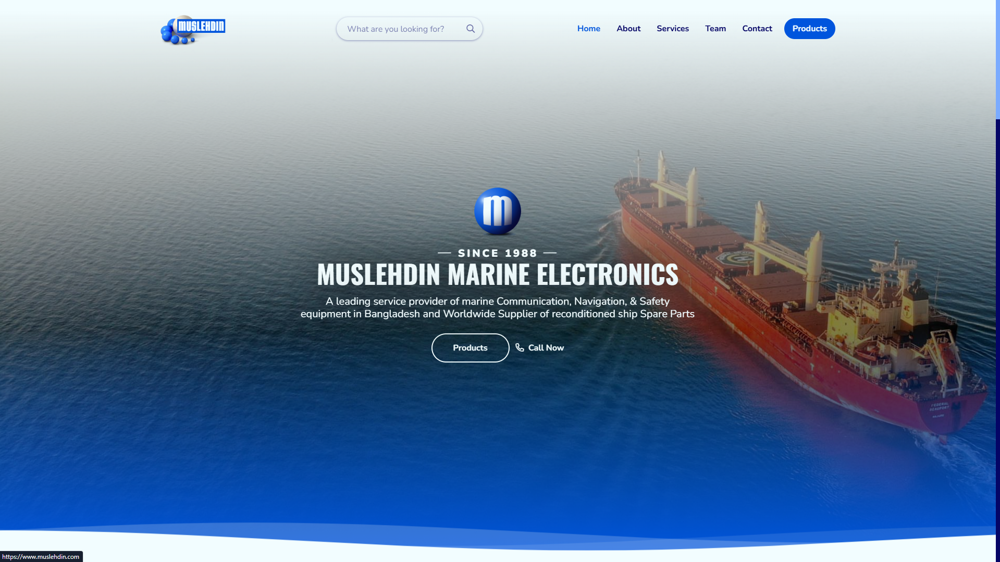

# Muslehdin Marine Electronics (Portfolio)

A small, single-page website / landing page for Muslehdin Marine Electronics (Chittagong, Bangladesh). The company has wound down and no longer maintains a domain, so this repository is kept as a portfolio piece and a static snapshot of the original site.

## Status
- Company: closed / business ended.
- Repo: archived as a portfolio/demo. Contact form requires a PHP-capable server and will not work when served as static pages (e.g., GitHub Pages).

## Preview
- You can view the site locally or host it on any PHP web server. (Note: GitHub Pages only serves static files — the PHP contact form will not send email there.)

## Quick start (local)
1. Clone the repo:
   git clone https://github.com/Aminul-Islam7/Muslehdin.git
2. Serve with PHP built-in server from the repo root:
   php -S localhost:8000
3. Open http://localhost:8000 in your browser.

## Notes for maintainers
- The main page is index.php. The contact form posts to the same file using PHP's mail(), and email configuration must be available on the host for it to work.
- SCSS sources are in assets/sass/ and compiled CSS lives in assets/css/.
- Large media assets (images, animations) live under assets/img/.

## Credits
- Designed & developed by Aminul Islam (Aminul-Islam7).
